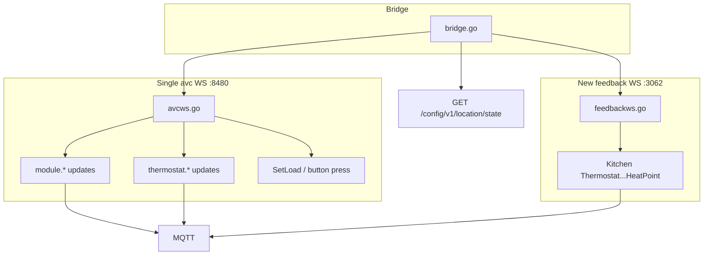

# Phase 2: Real-time thermostat state (avc + feedback WS)

## Can we put this in [`avcws.go`](avcws.go)?

**Partially — not the openapi feedback API.**

| Connection | Port | Path | Protocol | Used for |
|------------|------|------|----------|----------|
| **avc** ([`avcws.go`](avcws.go)) | 8480 | `ws://host:8480` | `savant_protocol` | Lighting control + `state/register` categories (`module`, `scene`, `thermostat`) |
| **openapi feedback** (new) | 3062 (or 3060 external) | `ws://host:3062/feedback/v1/register` | No subprotocol; `feedback/state/*` URIs | Read-only StateCenter subscriptions by **state name** |

They are different servers and message shapes. Merging feedback into `AVCClient` would mean one struct dialing two URLs with incompatible handshakes — avoid that.

**What you already have:** [`bridge.go`](bridge.go) line 341 already calls `Subscribe("module", "scene", "thermostat")` on the **same** avc connection as lighting. [`handleThermostatUpdate`](bridge_hvac.go) receives `thermostat.<addr>` pushes but only logs and calls `refreshThermostatStates()` (full REST poll) because the value format was unknown at implementation time.



---

## Path A — Improve avc thermostat handling (same connection as lights)

### A1. On-host spike (short)

While savantserver runs on the Savant host, change a thermostat from the Savant UI and capture avc `state/update` lines for `thermostat.*` (temporarily log all non-`module`/`scene` updates in [`avcws.go`](avcws.go) or watch stderr).

Record: state key pattern (`thermostat.1` vs hex), value format (JSON blob, comma-separated, single field).

### A2. Implement parser in [`bridge_hvac.go`](bridge_hvac.go)

Replace the “always REST refresh” stub in `handleThermostatUpdate`:

- Resolve entity via existing `thermostatAddrIdx` (address from feedback metadata, already `1` for your SST-W300s).
- If `update.Value` maps to known fields (mode, setpoints, temp), call `applyHvacStateValue` for the right logical keys and `PublishThermostatState`.
- If format is opaque or partial, **fall back** to a single-entity or batched REST refresh (narrower than today’s full refresh).

No changes to [`avcws.go`](avcws.go) subscribe API unless spike shows a different category name — subscription is already combined with lighting.

---

## Path B — openapi feedback WebSocket (separate client)

Per [`docs/03-openapi-websocket.md`](docs/03-openapi-websocket.md):

**Subscribe (outbound, `URI` uppercase):**
```json
{"URI":"feedback/state/register","messages":[{"states":["Kitchen Thermostat.HVAC_controller.ThermostatCurrentHeatPoint", "..."]}]}
```

**Updates (inbound, `uri` lowercase):**
```json
{"uri":"feedback/state/update","messages":[{"Kitchen Thermostat.HVAC_controller.ThermostatCurrentHeatPoint":"72"}]}
```

### B1. New [`feedbackws.go`](feedbackws.go)

Mirror structure of [`avcws.go`](avcws.go) but feedback-specific:

- `FeedbackClient` with `Connect(ctx)` → dial `ws://{host}:{restPort}/feedback/v1/register`
- `RegisterStates(names []string)` → `feedback/state/register`
- `ReadLoop(ctx, handler)` → parse `feedback/state/update`; normalize `uri` vs `URI`
- `Close()`, write mutex, logger prefix `[feedback]`

Define `FeedbackStateUpdate` with `StateName` and `Value` (or pass map per message).

### B2. Bridge wiring in [`bridge.go`](bridge.go) + [`bridge_hvac.go`](bridge_hvac.go)

At startup after thermostat discovery:

1. Build flat list of all Savant state names from `thermostat.StateNames` (dedupe).
2. Build reverse index: `stateName → []{entity, logicalKey}` for O(1) dispatch.
3. `connectFeedback(ctx)` — parallel to `connectAVC`, not inside `AVCClient`.
4. `go feedback.ReadLoop(ctx, b.handleFeedbackStateUpdate)`.
5. `handleFeedbackStateUpdate`: `applyHvacStateValue` + `finalizeThermostatState` + `PublishThermostatState` (same as poll path today).

**Reconnect:** Separate loop (e.g. 8–10 min per docs stability caveat), or piggyback on avc reconnect timing with independent reconnect — do not share one TCP connection.

Config: reuse `savant.rest_port` (3062 on-host); no new YAML field required initially.

### B3. Initial hydration bonus

Feedback WS pushes **current values on register** — may reduce need for a large startup `FetchStates` batch for thermostats (keep one REST hydrate as fallback if register push is incomplete).

---

## Poll loop changes ([`bridge_hvac.go`](bridge_hvac.go))

| Current | Target |
|---------|--------|
| `thermostatPollLoop` every 45s, full REST | **Backup only**: 5–10 min tick, or remove if feedback + avc prove reliable on-host |
| `handleThermostatUpdate` → full REST refresh | Targeted refresh or inline parse |
| Post-command `go refreshThermostatStates` | Keep (optimistic + confirm) |

---

## Tests

- [`feedbackws_test.go`](feedbackws_test.go): mock WS server; register + inject `feedback/state/update`; assert handler receives name/value.
- [`bridge_hvac_test.go`](bridge_hvac_test.go): `handleFeedbackStateUpdate` updates cache and publishes; avc `handleThermostatUpdate` with sample payloads from spike (fixture file `testdata/avc_thermostat_update.json` once captured).

---

## Docs

- [`docs/03-openapi-websocket.md`](docs/03-openapi-websocket.md) — add “used by savantserver for HVAC live state”
- [`docs/06-design.md`](docs/06-design.md) — dual-path diagram; clarify avc vs feedback roles
- [`CLAUDE.md`](CLAUDE.md) — list `feedbackws.go`

---

## Recommended implementation order

1. **Spike** avc `thermostat.*` message format on-host (30 min).
2. **feedbackws.go** + bridge register/read loop (primary reliable path for named HVAC states).
3. **Improve** `handleThermostatUpdate` if spike shows parseable avc payloads.
4. **Reduce** 45s poll to backup interval or remove.
5. Tests + docs.

## What stays unchanged

- Lighting: avc only ([`avcws.go`](avcws.go), `module` updates).
- HVAC commands: REST `PUT .../command`.
- HVAC discovery: REST + `GET /feedback/v1/states/hvac`.
- REST reads: `GET /config/v1/location/state` (fallback / post-command confirm).
